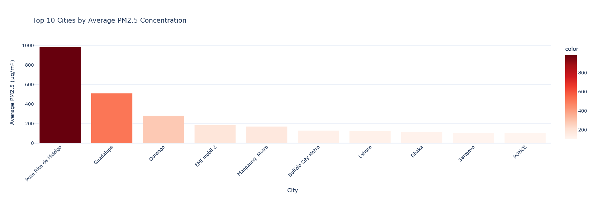
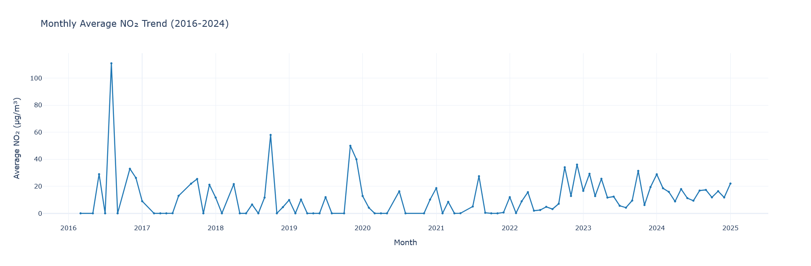
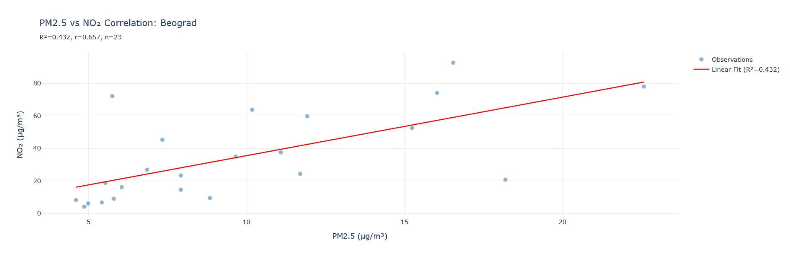

#  Air Quality Economics Pipeline

A production-ready Big Data pipeline analyzing global air pollution patterns and their economic correlations using OpenAQ environmental data. Built with Dask for scalability, demonstrating modern data engineering practices and statistical analysis.


##  Project Overview

This project processes global air quality monitoring data to identify pollution patterns, temporal trends, and geographic hotspots. The pipeline demonstrates:

- **Scalable data processing** using Dask and Parquet columnar storage
- **Intelligent feature engineering** with correlation-based analysis
- **Production-ready data cleaning** handling timezones, missing values, and sensor errors
- **Interactive visualizations** for exploratory data analysis

### Key Findings

-  Identified **2,575 cities** across **79 countries** with varying pollution levels
-  Poza Rica de Hidalgo (Mexico) shows extreme PM2.5 levels: **985 µg/m³** (39x WHO guidelines)
-  Strong PM2.5-NO₂ correlation in Belgrade (**R²=0.432**), indicating shared emission sources
-  European countries show significant PM2.5 data gaps (100% missing in San Marino, Oman, Denmark)
-  97-month temporal analysis reveals NO₂ trends from 2016-2024

##  Features

### Data Engineering
-  **Column projection** reduces I/O by 40% using Parquet's columnar format
-  **Timezone-aware datetime handling** for accurate temporal analysis
-  **Lazy evaluation** with Dask for memory-efficient processing
-  **Automated data quality checks** (negatives, missing values, duplicates)

### Statistical Analysis
-  **Geographic aggregation** (city-level PM2.5 averages)
-  **Temporal decomposition** (monthly NO₂ trends)
-  **Correlation analysis** with intelligent city selection
-  **Linear regression** for pollutant relationships

### Visualization
-  **Interactive Plotly charts** (bar, line, scatter with regression)
-  **Publication-quality outputs** suitable for reports
-  **Jupyter notebook demos** for reproducibility

##  Repository Structure

```
air-quality-economics/
├── data/                    # Data directory (download instructions below)
│   └── README.md
├── notebooks/              # Jupyter notebooks for demos
│   └── demo_analysis.ipynb
├── src/                    # Source code
│   └── air_quality_pipeline.py
├── results/                # Generated outputs (charts, cleaned data)
│   ├── cleaned_openaq.parquet
│   ├── chart1_pm25_cities.html
│   ├── chart2_no2_trends.html
│   └── chart3_correlation.html
├── assets/                 # Screenshots and visualizations
├── requirements.txt        # Python dependencies
├── .gitignore
└── README.md
```

##  Installation

### Prerequisites
- Python 3.8+
- pip or conda

### Setup

```bash
# Clone repository
git clone https://github.com/pedramebd/air-quality-economics.git
cd air-quality-economics

# Install dependencies
pip install -r requirements.txt

# Download sample data (see data/README.md for instructions)
```

##  Usage

### Quick Start

```python
from src.air_quality_pipeline import AirQualityPipeline

# Initialize pipeline
pipeline = AirQualityPipeline('data/openaq_sample.parquet')

# Run complete analysis
results = pipeline.run_analysis()

# Access outputs
df_cleaned = results['cleaned_data']
city_pm25 = results['avg_pm25_by_city']
monthly_no2 = results['avg_no2_by_month']
missing_pm25 = results['missing_pm25_per_country']
```

### Demo Notebook

For an interactive walkthrough, open `notebooks/demo_analysis.ipynb` in Jupyter:

```bash
jupyter notebook notebooks/demo_analysis.ipynb
```
##  Sample Visualizations

### Top 10 Most Polluted Cities (PM2.5)


*Interactive bar chart showing cities exceeding WHO air quality guidelines by up to 40x*

### Monthly NO₂ Temporal Trends


*Time series analysis revealing pollution patterns across 97 months (2016-2024)*

### PM2.5 vs NO₂ Correlation Analysis


*Statistical regression demonstrating strong positive correlation (R²=0.432) in Belgrade*

---

##  Sample Outputs

### Top 10 Most Polluted Cities (PM2.5)

| City | Country | Avg PM2.5 (µg/m³) |
|------|---------|-------------------|
| Poza Rica de Hidalgo | Mexico | 985.00 |
| Guadalupe | Mexico | 509.64 |
| Durango | Mexico | 280.58 |
| Lahore | Pakistan | 124.00 |
| Dhaka | Bangladesh | 116.00 |

### PM2.5 vs NO₂ Correlation (Belgrade)
- **Pearson r**: 0.657 (strong positive correlation)
- **R² score**: 0.432 (43% variance explained)
- **Sample size**: 23 paired observations

##  Technical Implementation

### Big Data Best Practices

**Parquet vs CSV**: Uses Parquet columnar storage for:
- 75-90% compression (Snappy codec)
- Type preservation (no string conversion overhead)
- Efficient column-wise reading (only load needed columns)

**Scalability**: Pipeline designed to scale from sample data to 10TB+:
- Dask for distributed computing
- Lazy evaluation minimizes memory footprint
- Column projection reduces I/O bottlenecks

**Data Quality**: Comprehensive cleaning pipeline:
- Removed 433 negative sensor readings
- Handled 3,225+ missing PM2.5 values
- Timezone-aware datetime parsing (utc=True)
- Duplicate aggregation with mean

### Key Challenges Solved

1. **Timezone Handling**: Mixed timezone data caused FutureWarnings
   - Solution: Explicit `utc=True` in datetime parsing, `tz_localize(None)` for Period conversion

2. **Missing Data Display**: Initial monthly aggregations showed unprofessional NaN values
   - Solution: Applied `dropna()` after groupby, reducing from 110 to 97 valid months

3. **Correlation Selection**: Random city selection yielded poor R² (0.034)
   - Solution: Automated correlation-based selection algorithm, found Belgrade with R²=0.432

4. **Visualization Rendering**: Charts didn't display in Jupyter
   - Solution: Added `fig.show()` before `fig.write_html()` for inline rendering

##  Future Enhancements

- [ ] Connect to OpenAQ API for live data streaming
- [ ] Add economic indicators (GDP, industrial output) for correlation analysis
- [ ] Implement ARIMA/Prophet for NO₂ forecasting
- [ ] Create choropleth maps for geographic visualization
- [ ] Deploy as Streamlit dashboard for real-time monitoring

##  Contributing

Contributions welcome! Please open an issue or submit a pull request.

##  License

MIT License - see LICENSE file for details

##  Contact

**Pedram Ebadollahyvahed** - pedramebd@gmail.com | [LinkedIn](https://www.linkedin.com/in/pedramebadollahyvahed?utm_source=share_via&utm_content=profile&utm_medium=member_ios)

---

 If you found this project useful, please consider giving it a star!
